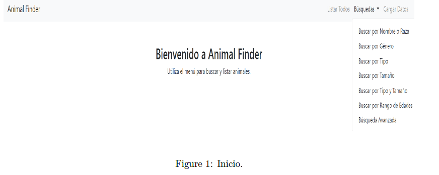
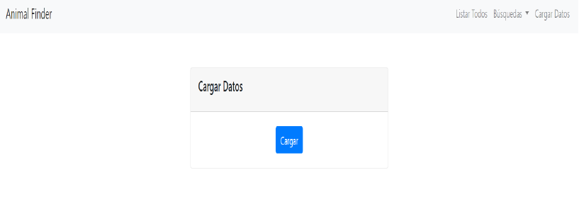
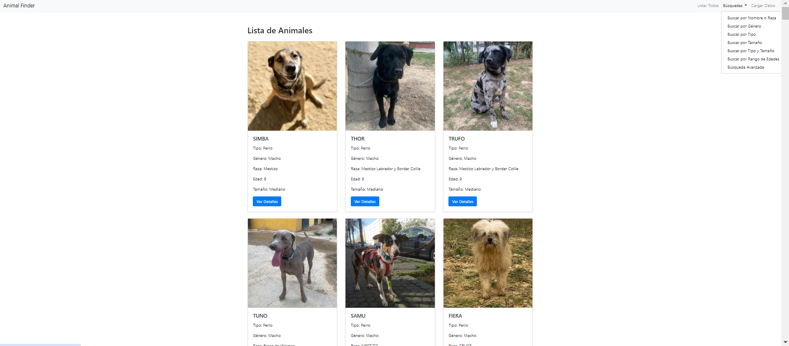
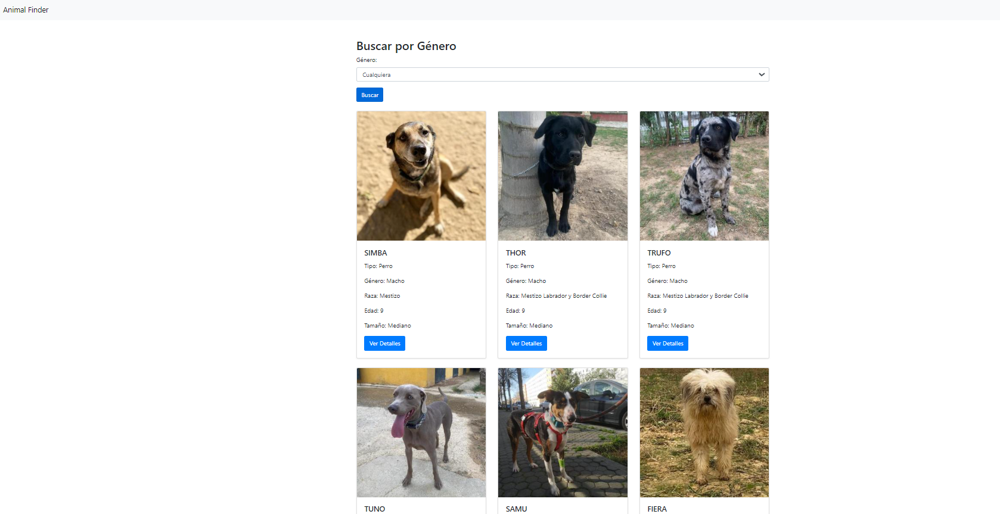
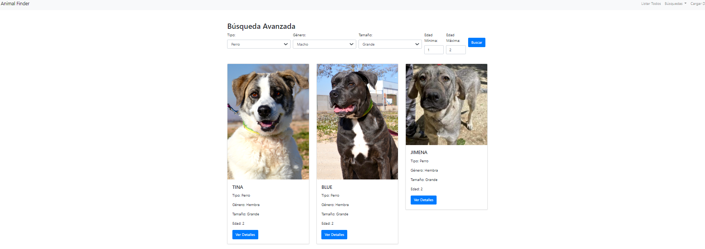

# PETFINDER Project

The PETFINDER project aims to facilitate the adoption of shelter animals by creating a centralized web platform. To simplify the search process and promote responsible pet adoption, this project uses web scraping techniques to collect information from various animal shelter websites and present it in a unified location.

Key technologies used include:
- **Django:** A Python web development framework that provides a flexible environment for building web applications.
- **BeautifulSoup:** A Python library designed for extracting data from HTML and XML files efficiently.
- **Whoosh:** A text search engine that allows users to perform custom and efficient searches on the collected animal database.

## Objectives

1. **Facilitate Animal Adoption:** The main goal is to promote the adoption of shelter animals by providing a centralized platform where users can easily find animals available for adoption.
2. **Simplify Search Process:** Streamline and expedite the search process for adoption by allowing users to perform customized searches.
3. **Unify Information from Various Sources:** Use web scraping techniques to gather information from multiple animal shelter websites and present it in a single platform, making it easier to access a wide range of animals available for adoption.

## Technologies

### Django
Django is a Python web framework used to create the centralized web platform for displaying collected animal data.

### BeautifulSoup
BeautifulSoup is used for web scraping across various animal shelter websites to extract detailed information about each available animal. It scrapes data from websites like arcadenoe.org and ciudadanimal.org, including images for visualization on the platform.

### Whoosh
Whoosh is a text search engine utilized to implement search functionalities on the web platform, enabling users to find animals quickly based on their search criteria.

### SQLite
SQLite is used to manage and store both the scraped animal data and user interactions with the platform.

## Usage


### Homepage
Upon visiting the homepage, users will see a welcome message and navigation options for various operations.


### Data Loading Page
This page allows you to load all extracted data from the web scraping process into the SQLite database.


### List All
Displays a list of all animals in the SQLite database with their respective information. The list is generated using Whoosh operations.


### Search Section
Provides various search options to find animals in the database based on different criteria, including:
- Search by Name or Breed
- Search by Gender
- Search by Type
- Search by Size
- Search by Type and Size
- Search by Age Range
- Advanced Search





## Installation

1. **Download the Project:**
   ```bash
   pip install -r requirements.txt
   python manage.py migrate
   
2. **Run the Project:**
  python manage.py runserver

3. **Load Data:**
   Use the data loading page to populate the database with scraped information.


